# 钱包一览表

::: tip
如果在使用此文档期间出现其他问题，可以在[twitter](https://twitter.com/Mo_Wmusk)留言，笔者尽力实时响应。
:::

## fork代码

创建github账户，本期先不在讲如何创建账户，后续会有其他文章专门介绍。
fork[代码](https://github.com/wxtsky/MyWalletScan)，链接是作者链接，大家可以关注下[Github](https://github.com/wxtsky/MyWalletScan)和[twitter](https://twitter.com/jingluo0)。

::: tip
北北辛苦付出不容易，大家可以多多支持。[效果预览](https://bitboxtools.github.io/#/zksync)，代码笔者已经审计，库和代码暂无问题，如果后续有更新会持续跟进，并在推特进行提醒。
:::

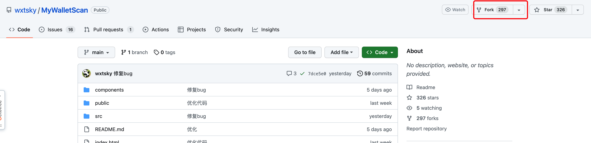

将代码拉取到自己仓库。

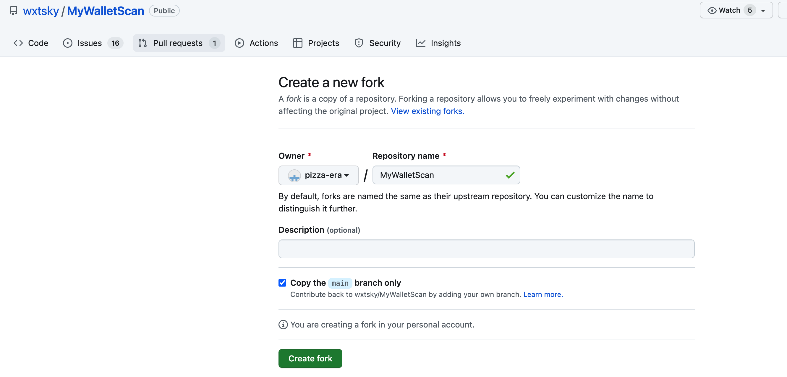

## workflow

打开自己仓库，并点击`action`。

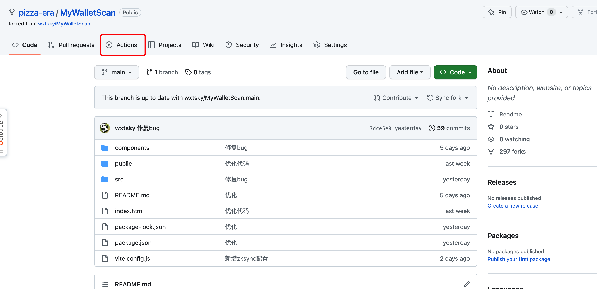

然后选择自定义`workflow`，这里主要是进行自定义部署。

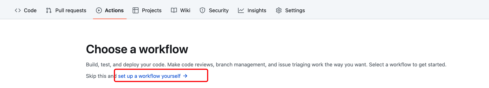

将下面代码粘贴，注意这里` echo "www.xxxxxxx.github.io" >> ./dist/CNAME `改成自己网站，例如这里笔者就要改成`www.pizza-era.github.io`。

```shell
 name: Deploy to GitHub Pages
   
   on:
     push:
       branches:
         - main # 或其他您希望触发 CI 的分支
   
   jobs:
     build-and-deploy:
       runs-on: ubuntu-latest
   
       steps:
         - name: Checkout repository
           uses: actions/checkout@v2
   
         - name: Setup Node.js
           uses: actions/setup-node@v2
           with:
             node-version: '18' # 或其他您希望使用的 Node.js 版本
   
         - name: Run Export
           run: |
             export TZ='Asia/Shanghai'
             npm install
             npm run build
             echo "www.xxxxxxx.github.io" >> ./dist/CNAME    # 自己预期的网站
   
         - name: Deploy to GitHub Pages
           uses: JamesIves/github-pages-deploy-action@4.1.0
           with:
             branch: gh-pages # 部署到的分支（通常为 gh-pages）
             folder: ./dist # 构建生成的静态文件夹路径（根据您的项目配置进行修改）
```

编写后的效果如图所示：

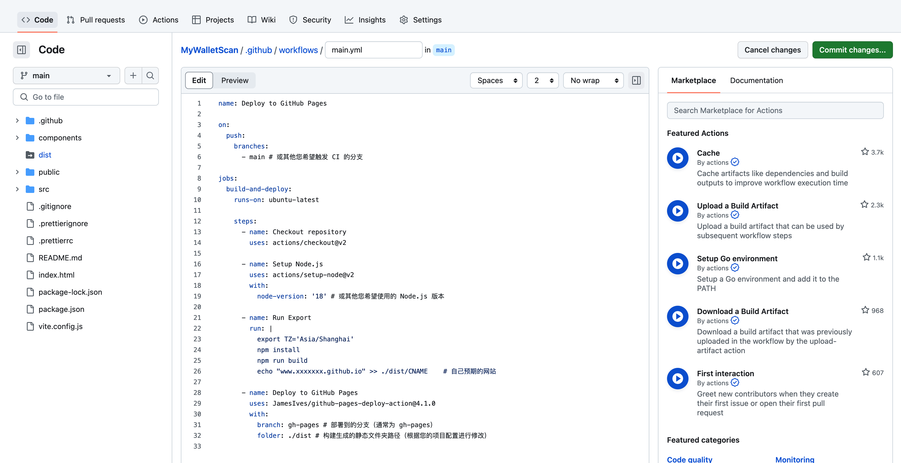

点击commit。

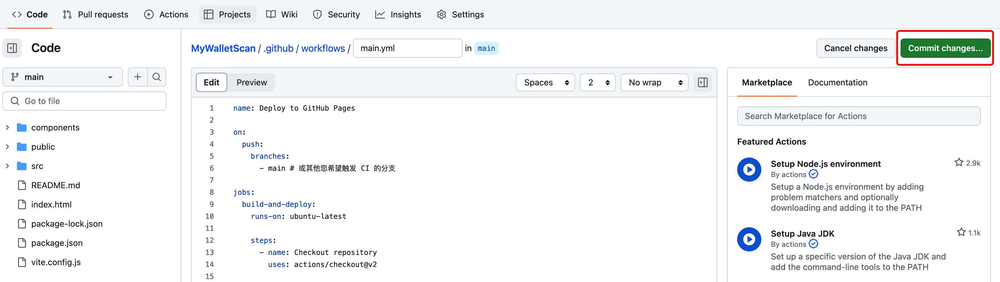
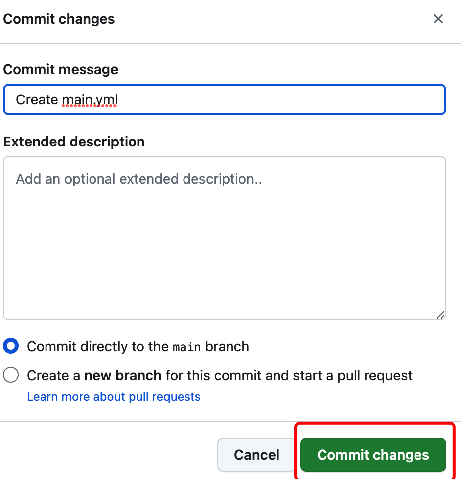

这个时候会自动部署。部署会出现`Error: The deploy step encountered an error: The process '/usr/bin/git' failed with exit code 128 ❌`错误。

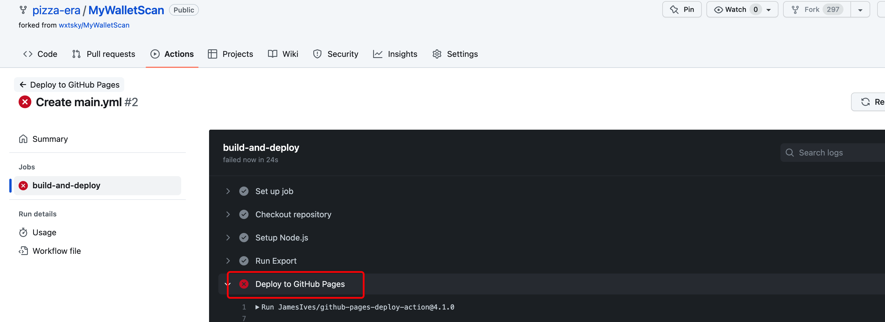

## 修改权限

配置权限，按照图中所示点击`Setting -> Actions`。

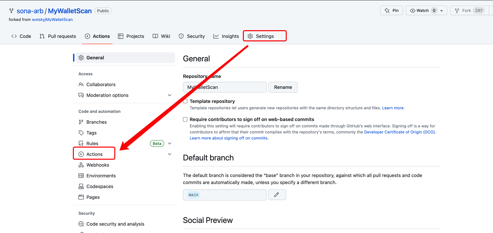

给`workflow`读写权限。

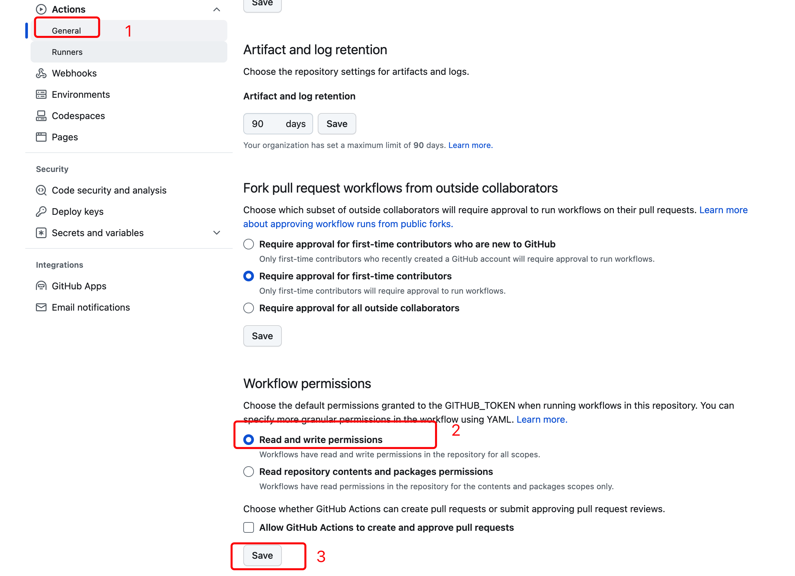

## 重跑job

回到`action`点击部署，这里`Create main.yml`可以点击进去。

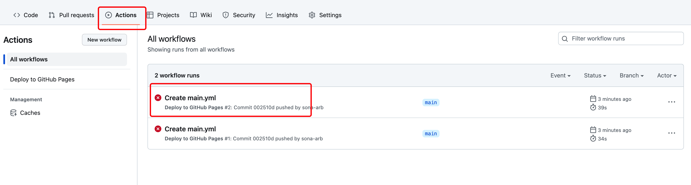

重新跑`workflow-job`。

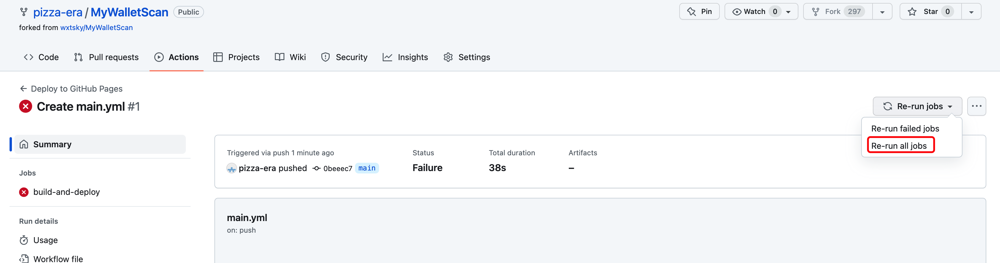

job如图所示运营成功。

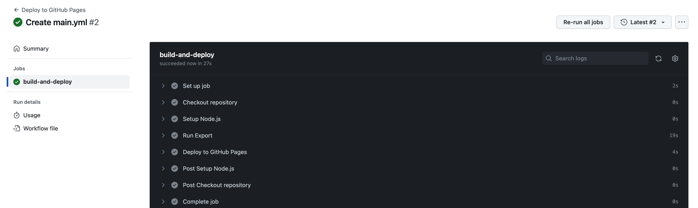

查看运行效果，是否有`gp-pages`分支

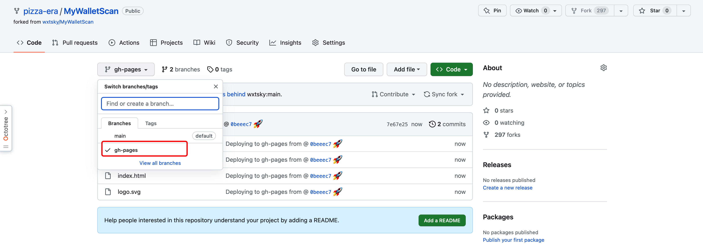

## 配置页面

配置域名。

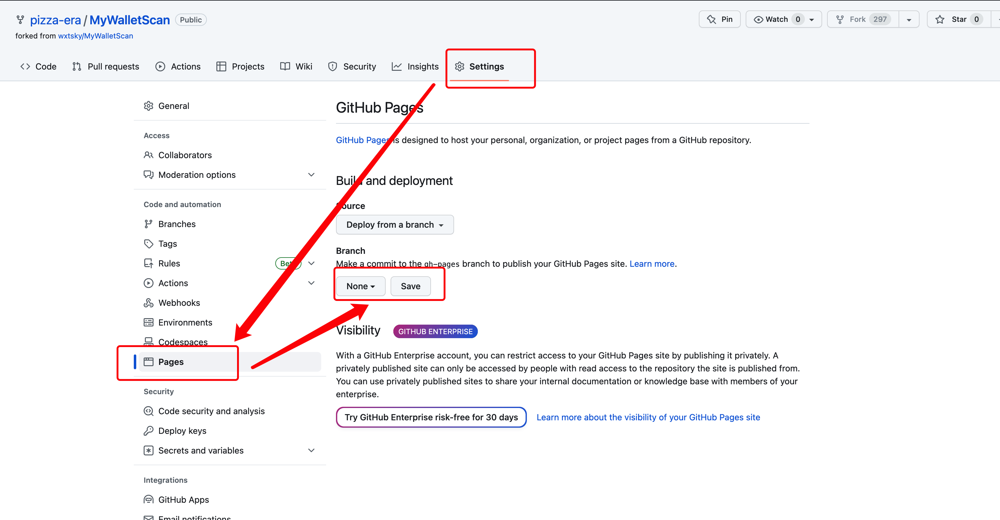

分支选择`gh-pages`。

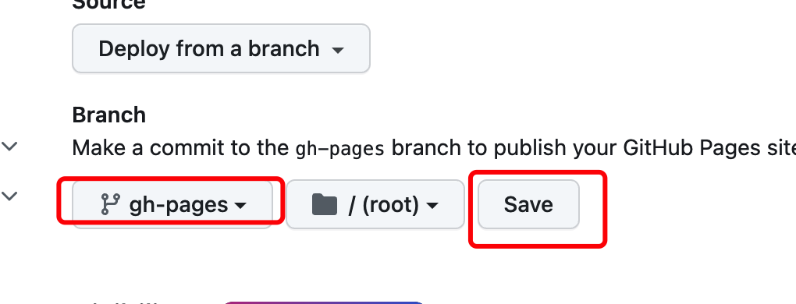

将这里网站粘贴进去，点击`save`。

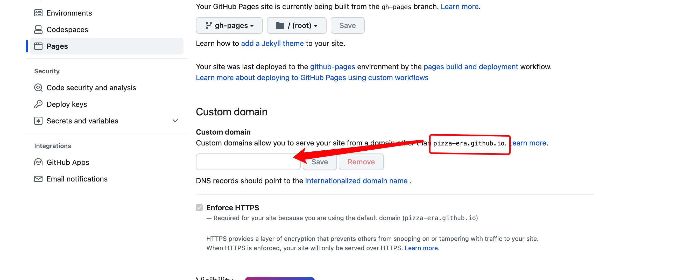

这里会出现部署，点击`visit site`即可查看网站。

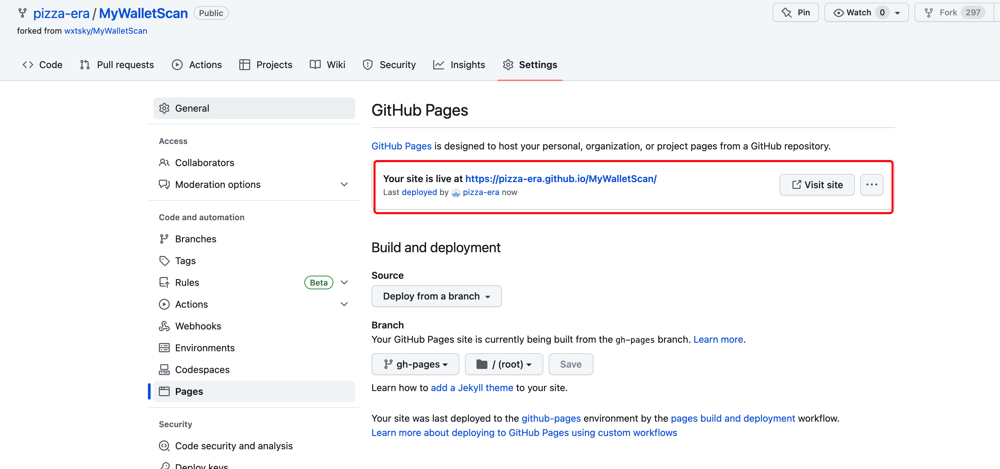

如图所示：

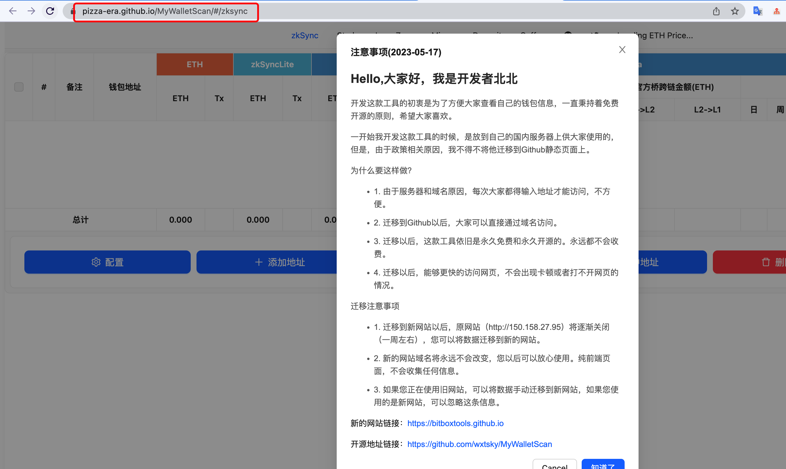
